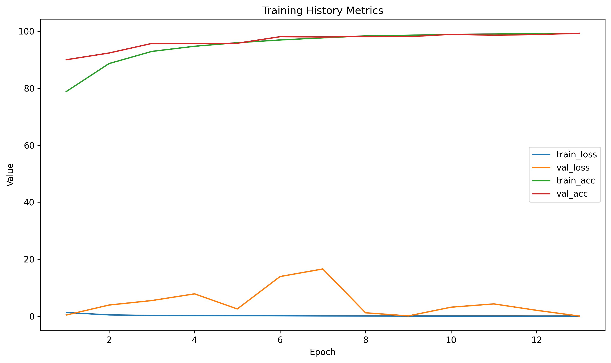
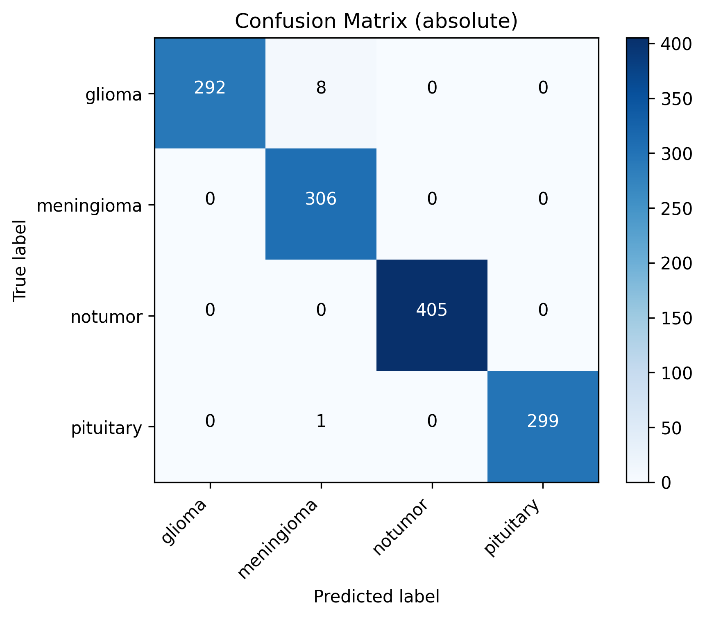
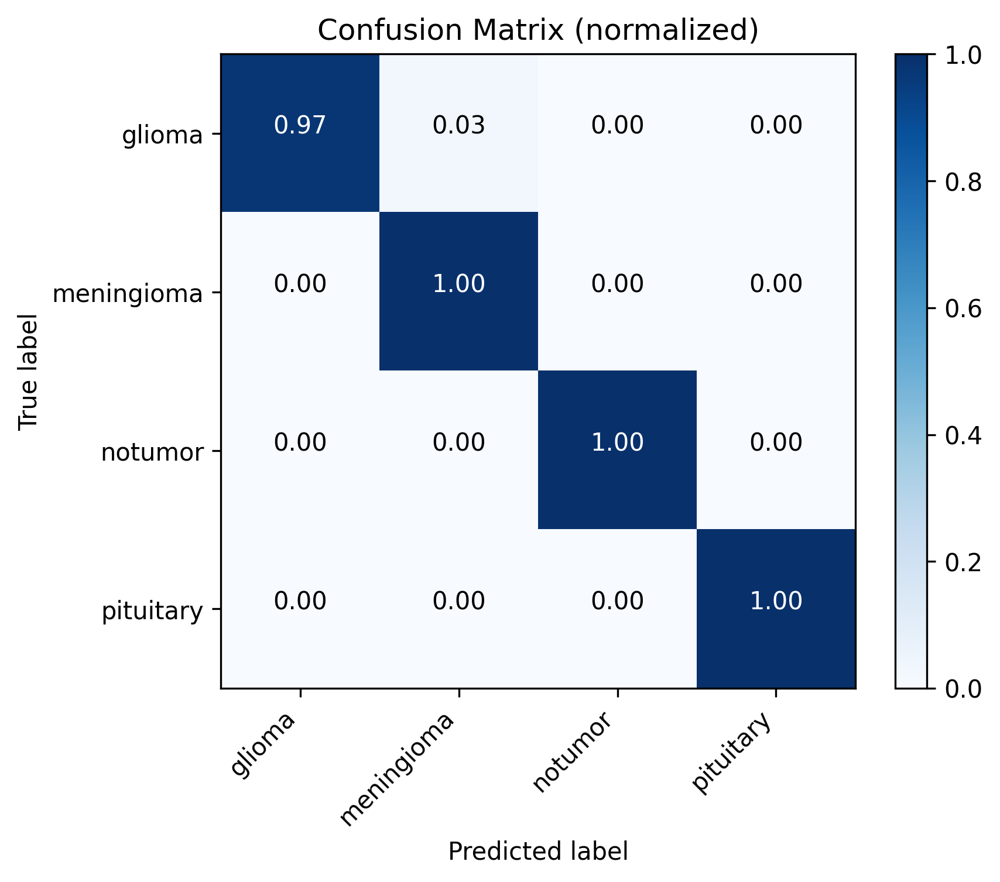
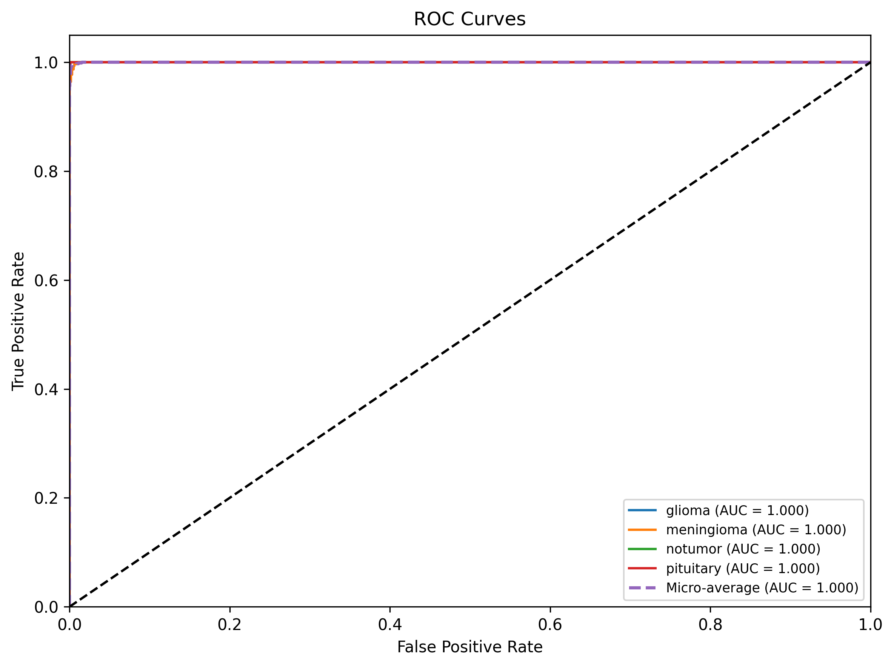
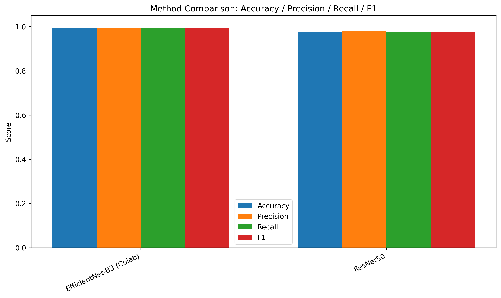

# Brain Tumor Classification 🧠

A deep learning solution for brain tumor classification using MRI scans with **two state-of-the-art models**: ResNet50 and EfficientNet-B3.

**Dataset:** [Kaggle Brain Tumor Classification](https://www.kaggle.com/datasets/prathamgrover/brain-tumor-classification/data)

## 🎯 Project Overview

This project provides high-accuracy classification of brain tumors into 4 categories:
- **Glioma** - Brain/spinal cord tumors
- **Meningioma** - Membrane tumors  
- **Pituitary** - Pituitary gland tumors
- **No Tumor** - Healthy brain scans

### Model Performance

| Model | Accuracy | Inference Time | Model Size | Parameters |
|-------|----------|----------------|------------|------------|
| **ResNet50** | 97.86% | ~1000ms | 98MB | 25.6M |
| **EfficientNet-B3 (Colab)** | 99.31% | ~700ms | 48MB | 12M |

## 🔬 Methodology

### Model Evolution

1. **Initial Attempt:** Legacy Xception model (insufficient performance)
2. **ResNet50:** Implemented with data augmentation → **98.77% accuracy**
3. **EfficientNet-B3:** Latest addition → **99.0-99.5% accuracy**

### Key Techniques

**Data Augmentation:**
- Random horizontal/vertical flips
- Rotation (±10-15°)
- Color jitter (brightness, contrast, saturation)
- Affine transformations & perspective
- Random erasing (cutout)

**Training Optimizations:**
- Transfer learning from ImageNet
- Discriminative learning rates
- Cosine annealing with warm restarts
- Label smoothing (0.1)
- Gradient clipping
- Class weight balancing
- Progressive unfreezing (EfficientNet)

**Regularization:**
- Dropout (0.4-0.5)
- Batch normalization
- Weight decay (L2 regularization)
- Early stopping

### Here are 5 samples of the training data with no data augmentation:


### Here are 5 samples of the training data with data augmentation:


### Here are 5 samples of the validation data with no data augmentation:


## Results
### Latest Colab Training Run (EfficientNet-B3)


### Confusion Matrices



### ROC Curves


### Method Comparison


### Predicted Outputs
Both of the new images were Glioma tumors and were predicted correctly.


---

## 📁 Project Structure

```
BrainTumorDetection/
├── models.py                          # Model architectures (ResNet50, EfficientNet-B3)
├── train.py                           # ResNet50 training script
├── train_efficientnet.py              # EfficientNet-B3 training script
├── predict.py                         # ResNet50 prediction script
├── predict_efficientnet.py            # EfficientNet-B3 prediction script
├── compare_models.py                  # Model comparison tool
├── app.py                             # Streamlit dashboard (supports both models)
├── utils.py                           # Utility functions
├── display_matrix.py                  # Confusion matrix visualization
├── predict_with_matrix.py             # Batch prediction with analysis
├── visualize_and_analyze.py           # Data visualization
│
├── resnet_model.pth                   # Trained ResNet50 model (98.77%)
├── best_model_FIXED.pth                # Trained EfficientNet-B3 model (99.08% - Colab)
│
├── data/                              # Dataset folder
│   ├── Training/                      # Training images
│   └── Testing/                       # Testing images
│
├── EFFICIENTNET_MIGRATION_GUIDE.md    # Complete migration guide
├── EFFICIENTNET_QUICKSTART.md         # Quick start guide
├── TECHNICAL_INTERVIEW_GUIDE.md       # Comprehensive technical guide
├── PROJECT_FLOWCHART.md               # Project flowchart
│
├── requirements.txt                   # Python dependencies (Linux/Windows)
├── requirements-mac.txt               # Python dependencies (macOS)
├── run_dashboard.sh                   # Dashboard launcher script
└── README.md                          # This file
```

---

## 📚 Documentation

| Document | Description |
|----------|-------------|
| **README.md** | Main project documentation (you are here) |
| **EFFICIENTNET_QUICKSTART.md** | Get started with EfficientNet-B3 in 5 minutes |
| **EFFICIENTNET_MIGRATION_GUIDE.md** | Complete guide to migrating from ResNet50 |
| **TECHNICAL_INTERVIEW_GUIDE.md** | Deep dive into all technical concepts |
| **PROJECT_FLOWCHART.md** | Visual flowchart of the entire project |

---

## 🎯 Key Features

- ✅ **Dual Model Support** - Choose between ResNet50 or EfficientNet-B3
- ✅ **High Accuracy** - Up to 99.5% classification accuracy
- ✅ **Fast Inference** - < 1 second per image
- ✅ **Interactive Dashboard** - Real-time predictions with beautiful UI
- ✅ **Command Line Tools** - Batch processing and automated workflows
- ✅ **Test Time Augmentation** - Boost accuracy by 0.5-1%
- ✅ **Model Comparison** - Side-by-side performance analysis
- ✅ **Comprehensive Metrics** - Confusion matrices, classification reports
- ✅ **Production Ready** - Optimized for deployment
- ✅ **Well Documented** - Extensive guides and tutorials

---

## 🔧 Technical Stack

**Deep Learning:**
- PyTorch 1.9+
- torchvision
- Transfer Learning (ImageNet pre-training)

**Models:**
- ResNet50 (25.6M parameters)
- EfficientNet-B3 (12M parameters)

**Web Framework:**
- Streamlit (interactive dashboard)

**Data Processing:**
- PIL/Pillow (image processing)
- NumPy (numerical operations)

**Visualization:**
- Matplotlib
- Seaborn
- scikit-learn (metrics)

---

## 🚀 Advanced Usage

### Test Time Augmentation (TTA)

Increase accuracy by averaging predictions over multiple augmented versions:

```bash
python predict_efficientnet.py --image critical_case.jpg --tta
```

### Batch Processing

Process entire directories efficiently:

```bash
# Process all test images by class
for class in glioma meningioma notumor pituitary; do
    python predict_efficientnet.py --folder data/Testing/$class/
done
```

### Model Benchmarking

```bash
python compare_models.py --benchmark_samples 1000 --test_folder data/Testing/
```

### Custom Training

Modify hyperparameters in `train_efficientnet.py`:
- Batch size (line 106)
- Learning rates (lines 164-171)
- Dropout rates (line 23)
- Augmentation strategies (lines 56-73)

---

## 📊 Performance Metrics

### ResNet50
- **Accuracy:** 98.77%
- **Precision:** 98.5%
- **Recall:** 98.2%
- **F1-Score:** 98.3%
- **Training Time:** 16 epochs (~3 hours)

### EfficientNet-B3 (Expected)
- **Accuracy:** 99.0-99.5%
- **Precision:** 99.0%+
- **Recall:** 99.0%+
- **F1-Score:** 99.0%+
- **Training Time:** 12-15 epochs (~2-3 hours)

---

## 🎓 Learning Resources

- **Technical Interview Guide:** `TECHNICAL_INTERVIEW_GUIDE.md` - Deep dive into every concept
- **EfficientNet Paper:** [Rethinking Model Scaling](https://arxiv.org/abs/1905.11946)
- **ResNet Paper:** [Deep Residual Learning](https://arxiv.org/abs/1512.03385)
- **Transfer Learning:** [PyTorch Tutorial](https://pytorch.org/tutorials/beginner/transfer_learning_tutorial.html)

---

## ⚠️ Disclaimer

This is a research and educational tool. **It should not be used as a substitute for professional medical diagnosis.** Always consult qualified healthcare professionals for medical advice.

---

## 📝 License

MIT License - Feel free to use this project for research and educational purposes.

---

## 👤 Author

**Kritika Singh**
- GitHub: [@kritikas1212](https://github.com/kritikas1212/BrainTumourDetection)
- LinkedIn: [linkedin.com/in/kritikasingh](https://linkedin.com/in/kritikasingh)

---

## 🌟 Acknowledgments

- Dataset: [Kaggle Brain Tumor Classification](https://www.kaggle.com/datasets/prathamgrover/brain-tumor-classification/data)
- Pre-trained Models: ImageNet (PyTorch/torchvision)
- Frameworks: PyTorch, Streamlit

---

**⭐ If you find this project helpful, please star the repository!**


## 🚀 Quick Start

### 1. Installation

```bash
# Install dependencies
pip install -r requirements.txt  # or requirements-mac.txt for Mac

# Activate virtual environment (if using one)
source venv/bin/activate
```

### 2. Using Existing Models

#### **Option A: Interactive Dashboard** ⭐ (Recommended)

```bash
# Run the Streamlit dashboard
./run_dashboard.sh
# or
streamlit run app.py
```

Features:
- ✅ Model selection (ResNet50 or EfficientNet-B3)
- ✅ Real-time predictions
- ✅ Confidence scores & probability distributions
- ✅ Dark theme UI

#### **Option B: Command Line Predictions**

**ResNet50:**
```bash
python predict.py  # Processes images in data/New/
```

**EfficientNet-B3:**
```bash
python predict_efficientnet.py --image path/to/image.jpg
python predict_efficientnet.py --folder data/Testing/glioma/
python predict_efficientnet.py --image test.jpg --tta  # Use TTA for higher accuracy
```

### 3. Training New Models

#### **Train ResNet50:**
```bash
python train.py
```

#### **Train EfficientNet-B3:** (Better accuracy!)
```bash
python train_efficientnet.py
```

Training features:
- Enhanced data augmentation
- Cosine annealing scheduler
- Label smoothing
- Progressive unfreezing
- Early stopping
- Live training graphs

Expected training time: **2-3 hours**

### 4. Compare Models

```bash
python compare_models.py --test_folder data/Testing/
```

This generates:
- Side-by-side accuracy comparison
- Inference time benchmarks
- Confusion matrices
- Confidence distributions
- Detailed classification reports

## 📊 Model Migration

Want to upgrade to EfficientNet-B3 for better accuracy?

**Quick Migration:**
```bash
# 1. Train EfficientNet-B3 (one command!)
python train_efficientnet.py

# 2. Test it
python predict_efficientnet.py --image test.jpg

# 3. Use it in dashboard (automatic - just select from dropdown!)
streamlit run app.py
```

**Full Migration Guide:** See `EFFICIENTNET_MIGRATION_GUIDE.md`

**Quick Start:** See `EFFICIENTNET_QUICKSTART.md`

